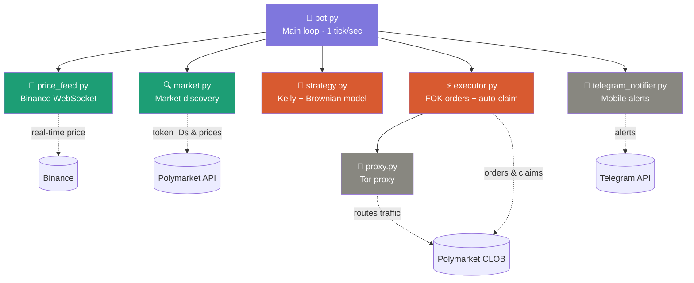
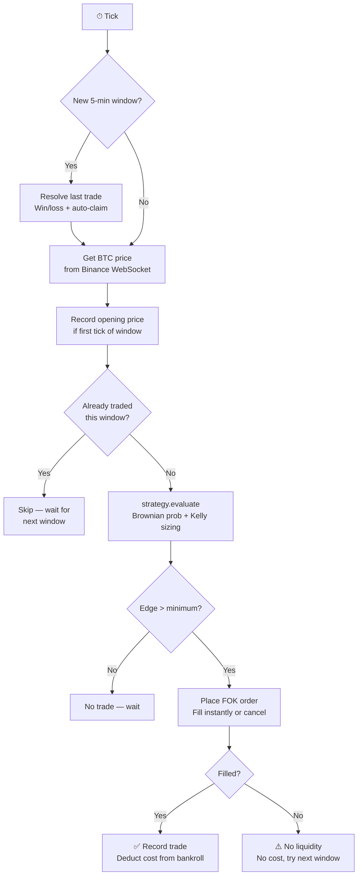
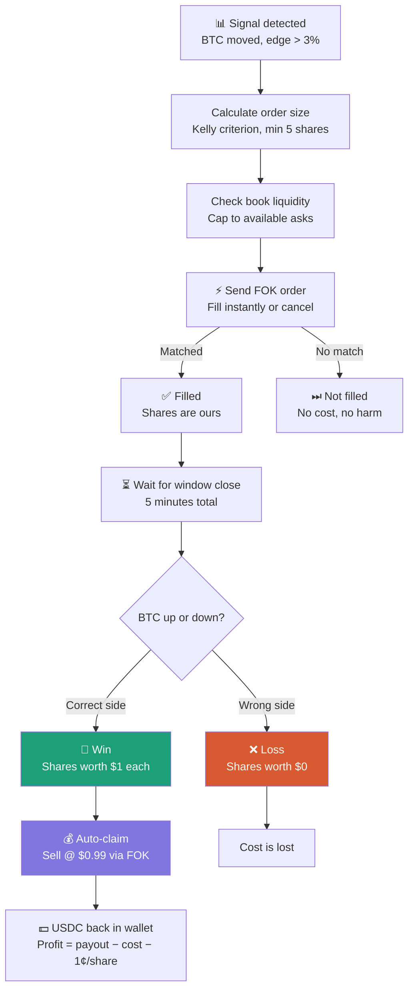

# PolyBot v4 — Oracle Lag Scalper

A Python trading bot for Polymarket's 5-minute BTC Up/Down markets.

## How it works

Every 5 minutes, Polymarket opens a market asking: "Will BTC be higher or lower at the end of this window?"

This bot exploits the **oracle lag** — the delay between when BTC moves on Binance (real-time) and when Polymarket's prices catch up. It watches BTC via Binance WebSocket, compares to the window's opening price, and places Fill-or-Kill orders when the market hasn't priced in a significant move.

## Architecture

```
bot.py                → Main loop (1 tick/second)
├── price_feed.py     → Binance WebSocket for real-time BTC price
├── market.py         → Discovers active 5-min market + token IDs
├── strategy.py       → Decision engine (Brownian model + Kelly criterion)
├── executor.py       → FOK orders via py-clob-client + auto-claim
├── telegram_notifier.py → Mobile alerts
└── proxy.py          → Tor proxy for CLOB API (live mode)
```

### Module map



### Main loop

Every second, `bot.py` runs a tick:



### Trade lifecycle



### Strategy logic

The strategy uses a **Brownian motion model** to estimate the true probability that BTC will close above/below its opening price:

1. **Calculate BTC delta** from the window's opening price
2. **Estimate true probability** using cumulative normal distribution (accounts for time remaining and historical 5-min BTC volatility)
3. **Compare to Polymarket's price** — the gap is our edge
4. **Size the bet with Kelly criterion** (quarter-Kelly for safety) — balances edge size against bankroll risk
5. **Entry window**: only trade between T-60s and T-10s — enough data to see a move, enough time for the order to fill

### Order execution (v4)

The executor enforces several Polymarket constraints:

- **FOK (Fill or Kill)**: orders fill instantly or cancel — no sitting on the book, no polling
- **Minimum 5 shares**: Polymarket CLOB requirement, auto-bumped if Kelly size is smaller
- **Clean decimals**: maker amount (USD) rounded to 2 decimals, shares to whole numbers
- **Liquidity cap**: checks the order book before sending — caps order to available asks
- **Auto-claim**: after a win, sells shares at $0.99 to convert back to USDC (~1¢/share fee)

## Quick Start

```bash
# 1. Clone
git clone https://github.com/JLowo/gengar_polymarket_bot.git
cd gengar_polymarket_bot

# 2. Install dependencies
pip install -r requirements.txt

# 3. Configure
cp .env.example .env
# Edit .env with your credentials (see below)

# 4. Run in dry-run mode (paper trading)
python bot.py

# 5. When ready for real trades, set DRY_RUN=false in .env
```

## Configuration (.env)

| Variable | Description |
| --- | --- |
| `PRIVATE_KEY` | Your wallet private key (0x prefixed) |
| `SAFE_ADDRESS` | Your Polymarket Safe address (from polymarket.com/settings) |
| `TELEGRAM_BOT_TOKEN` | From @BotFather on Telegram |
| `TELEGRAM_CHAT_ID` | Your numeric Telegram user ID |
| `TRADE_AMOUNT` | USD per trade (default: 5.0) |
| `MIN_EDGE` | Minimum edge to enter (default: 0.03 = 3%) |
| `DRY_RUN` | true = paper trade, false = real money |
| `KELLY_FRACTION` | Kelly fraction (default: 0.25 = quarter-Kelly) |
| `MIN_BET` | Minimum bet in USD (default: 1.0) |
| `MAX_BET` | Maximum bet in USD (default: 25.0) |
| `ENTRY_WINDOW_START` | Seconds before close to start looking (default: 60) |
| `ENTRY_WINDOW_END` | Seconds before close to stop looking (default: 10) |

## Risk Warning

This bot trades real money on volatile markets. Start with `DRY_RUN=true`.
When going live, use small amounts you can afford to lose entirely.
Past performance of any strategy does not guarantee future results.